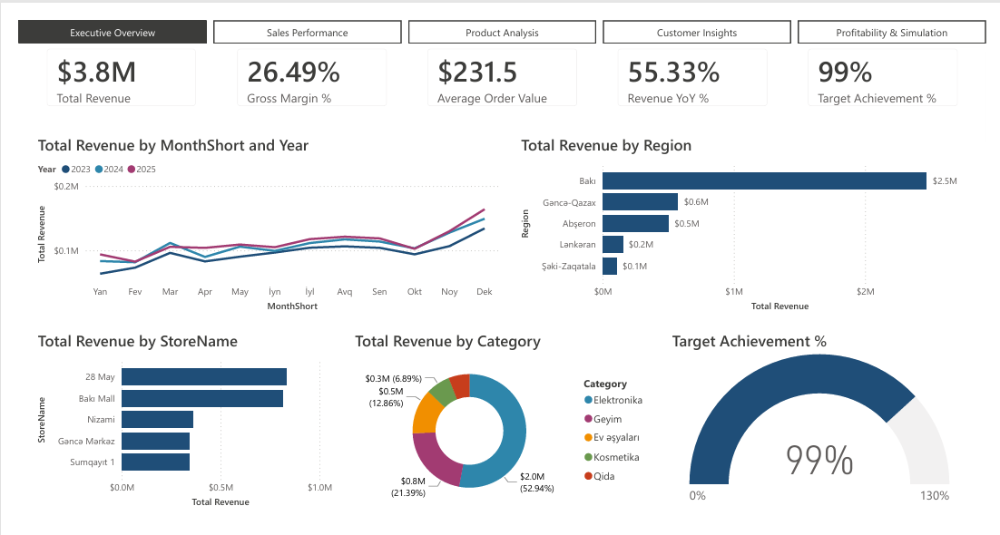
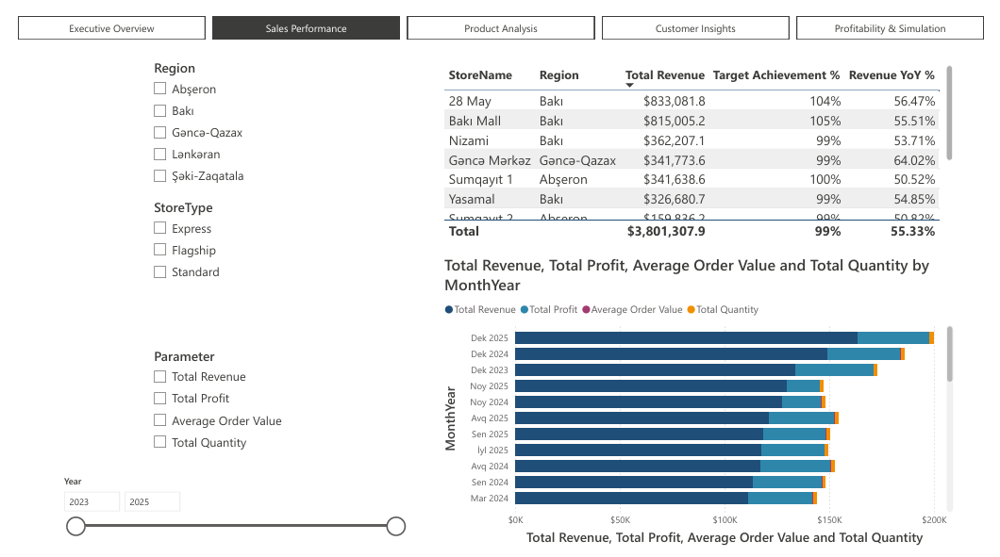
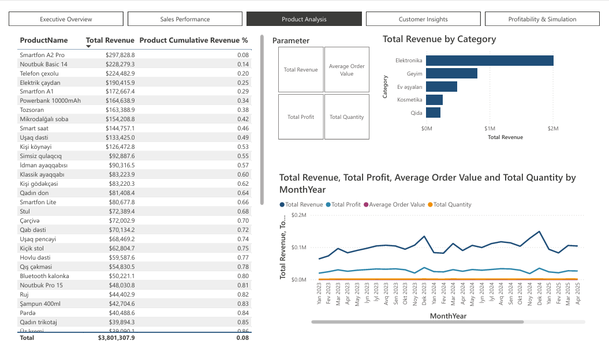
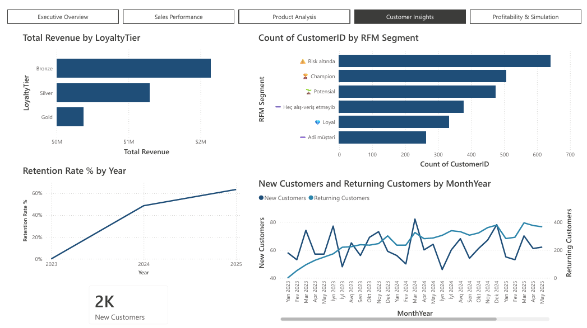
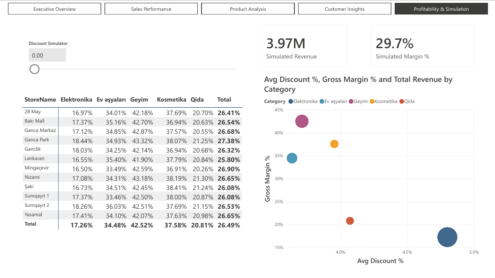
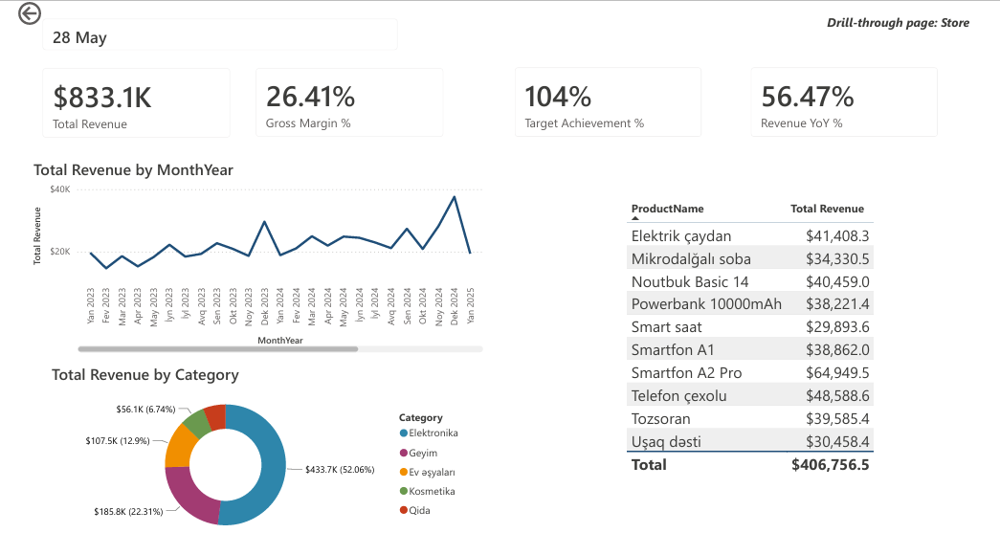

# Retail Sales Performance Dashboard — Power BI


> End-to-end retail analytics dashboard built in Power BI for a fictional retail chain operating across Azerbaijan. Features star/snowflake schema data modeling, 37 DAX measures, RFM segmentation, Pareto/ABC analysis, What-if discount simulation, and drillthrough store-level analytics.

---

## 📸 Dashboard Preview

| Executive Overview | Sales Performance |
|---|---|
|  |  |

| Product Analysis | Customer Insights |
|---|---|
|  |  |

| Profitability & Simulation | Store Deep-Dive |
|---|---|
|  |  |

---

## 📌 Project Overview

A fictional retail chain operating across Azerbaijan with 12 stores in 5 regions was used as the business scenario. The dashboard was built to simulate a real-world BI solution that enables management to monitor sales performance, customer behavior, and profitability in one place.

| | |
|---|---|
| **Tool** | Power BI Desktop |
| **Dataset** | Synthetic data generated with Python |
| **Time Period** | 2023 – 2025 (3 years) |
| **Transactions** | 31,000+ sales records |
| **Customers** | 2,600 |
| **Products** | 55 across 5 categories |
| **Stores** | 12 stores across 5 regions |

> The dataset was generated with realistic seasonal patterns including Novruz holiday spikes, Black Friday peaks, New Year surges, and year-over-year growth trends. Stores were deliberately assigned different performance tiers (Star / Solid / Underperformer) to enable meaningful storytelling.

---

## 🗂️ Data Model

**Star + Snowflake Schema** — 7 tables

```
Dim_Date ──────────────→ Fact_Sales ←──────── Dim_Product ←─── Dim_Category
                              ↑                                       ↑
Dim_Store ────────────────────┤                                       │
Dim_Customer ─────────────────┘                                       │
                                                                       │
                          Fact_Targets ←── Dim_Store                  │
                               ↑                                       │
                          Dim_Date          Dim_Category ──────────────┘
```

| Table | Type | Rows |
|---|---|---|
| Dim_Date | Dimension | 1,096 |
| Dim_Store | Dimension | 12 |
| Dim_Product | Dimension | 55 |
| Dim_Category | Snowflake Dimension | 5 |
| Dim_Customer | Dimension | 2,600 |
| Fact_Sales | Fact | 31,252 |
| Fact_Targets | Fact (Monthly Plan) | 2,132 |

> **Why a separate Dim_Category?** Fact_Targets is at category granularity (not product level), while Dim_Product[Category] is not unique. A dedicated Dim_Category table resolves this as a snowflake element, enabling clean relationships with both fact tables — a deliberate modeling decision to handle different granularity levels.

---

## 📐 DAX Measures

This project includes **37 DAX measures and calculated columns** organized across 6 categories:

- **Core Financials** — Revenue, COGS, Profit, Gross Margin %, AOV
- **Time Intelligence** — YoY%, YTD, MTD, Prior Month, MoM%, Running Total
- **Target vs Actual** — Target Achievement %, Variance to Target, Dynamic Status
- **Customer Analytics** — New vs Returning Customers, Retention Rate %
- **RFM Segmentation** — Recency, Frequency, Monetary (calculated columns + SWITCH)
- **Advanced Analytics** — Product Cumulative Revenue % (RANKX + Pareto), Store Rank, Discount Simulation

> All measures are stored in a dedicated `_Measures` table for clean organization.  
> 📄 See [`dax_measures.md`](dax_measures.md) for the complete list with formulas.

---

## 🖥️ Dashboard Pages

### 1. Executive Overview
Single-page summary for leadership — all key metrics at a glance.
- **5 KPI Cards:** Total Revenue ($3.8M), Gross Margin % (26.49%), Target Achievement % (99%), AOV ($231.5), Revenue YoY % (55.33%)
- Monthly revenue trend (2023 vs 2024 vs 2025 overlay)
- Revenue by region (bar chart)
- Top 5 stores ranking
- Revenue share by category (donut chart)
- Target achievement gauge (0–130%)

### 2. Sales Performance
- Store-level table with Target Achievement % and Revenue YoY %
- Dynamic metric chart powered by **Field Parameter** (Revenue / Profit / Quantity / AOV)
- Slicers: Region, Store Type, Year

### 3. Product Analysis
- **Pareto/ABC table** with Product Cumulative Revenue % (RANKX-based 80/20 analysis)
- Revenue by category (bar chart)
- Dynamic trend chart (Field Parameter)

### 4. Customer Insights
- **RFM Segmentation** — 6 segments (Champion, Loyal, Potential, At-Risk, Never Purchased, Regular)
- Revenue by Loyalty Tier (Bronze / Silver / Gold)
- Retention Rate trend (2023 → 2025)
- New vs Returning Customers monthly trend

### 5. Profitability & Simulation
- **Margin Heatmap** — Store × Category matrix with conditional background color
- **Discount vs Margin Scatter Chart** — bubble size = Total Revenue
- **Discount Simulator** (What-if Parameter: 0–30%) with real-time Simulated Revenue and Margin %

### 6. Store Deep-Dive *(Drillthrough — hidden page)*
Accessible via right-click → Drill through on any store in Sales Performance.
- Dynamic store name header
- 4 KPI cards filtered to selected store
- Monthly revenue trend
- Category breakdown (donut chart)
- Top 10 products table

---

## ⚙️ Technical Highlights

| Feature | Details |
|---|---|
| **Data Modeling** | Star + Snowflake schema, handling two fact tables at different granularity levels |
| **Time Intelligence** | YoY%, YTD, MTD, Prior Month — requires Mark as Date Table |
| **RFM Segmentation** | Calculated columns (Recency, Frequency, Monetary) + SWITCH(TRUE()) classification |
| **Pareto Analysis** | RANKX + iterative CALCULATE for cumulative revenue % |
| **What-if Parameter** | Discount Simulator (0–30%) with real-time revenue and margin impact |
| **Field Parameter** | Dynamic metric switching across visuals (Revenue / Profit / Qty / AOV) |
| **Drillthrough** | Store-level deep-dive page, hidden from navigation |
| **Page Navigator** | Navigation across 5 main pages, hidden pages excluded |
| **Custom Theme** | JSON theme file with brand colors and Segoe UI Semibold typography |
| **Sort by Column** | MonthShort and MonthYear sorted chronologically via calculated sort column |

---

